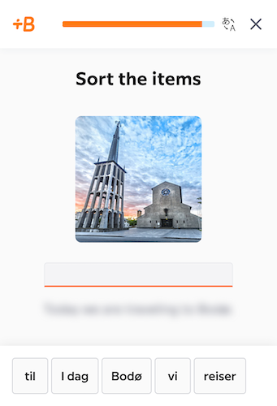

# Babbel - Hide Translations

This is a small extension that hides translation text in the Babbel web app. Press the hide translation button in the top navigation bar or press `` Ctrl+` `` to toggle the visibility of the translations.

